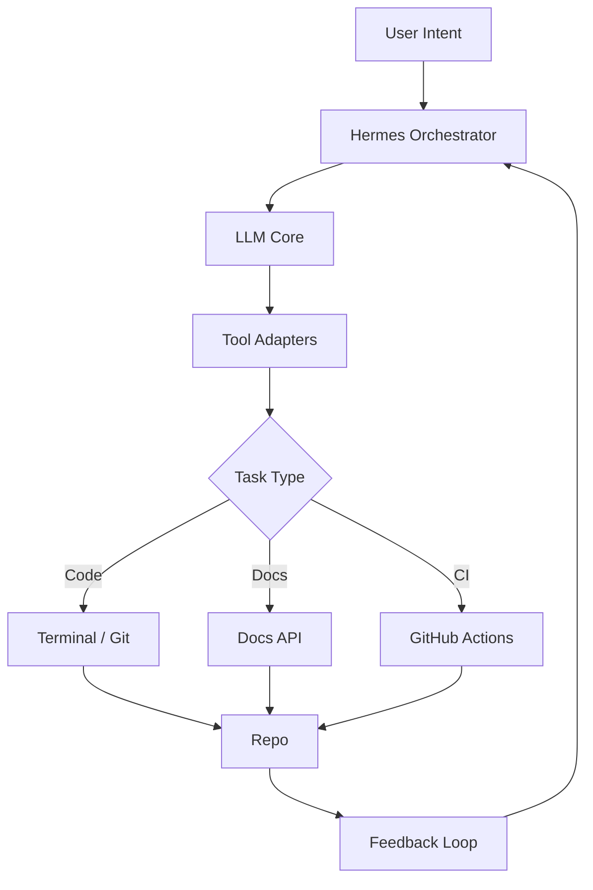

# Pembelajaran Perihan AI Agent Engineer

Materi ini memperkenalkan konsep, arsitektur, dan praktik membangun **AI Agent Engineer** — agen cerdas yang dapat mengotomatisasi tugas teknik perangkat lunak, mengelola proyek, dan berkolaborasi dengan developer.

## 1. Apa Itu AI Agent Engineer?
- **Definisi**: Agen AI yang dilengkapi dengan kemampuan pemrograman, debugging, CI/CD, dan manajemen proyek, beroperasi secara otonom atau semi‑otonom.
- **Komponen Utama**:
  - **Model LLM** (mis. OpenCode, Claude, Gemini) sebagai otak berpikir.
  - **Tooling Layer**: terminal, git, CI, issue tracker, dokumen.
  - **Orkestrasi**: workflow Fire, sub‑agent delegasi, cron jobs.
- **Use‑Case**: otomatisasi pull‑request, penulisan dokumentasi, pengujian, deployment, monitoring.

## 2. Arsitektur Referensi


## 3. Workflow Praktis (Fire Spec)
1. **Capture Intent** – pengguna menulis permintaan (mis. “Buat modul logging”).
2. **Decompose** – Hermes memecah menjadi subtugas (setup repo, buat file, tes). 
3. **Delegate** – gunakan `delegate_task` ke sub‑agent (OpenCode/Claude). 
4. **Execute** – sub‑agent menjalankan perintah terminal, menulis kode, push.
5. **Review** – LLM meng‑review PR, menambahkan komentar, meminta persetujuan.
6. **Merge & Deploy** – otomatisasi CI/CD lewat GitHub Actions.

## 4. Contoh Implementasi
### 4.1. Bot untuk Membuat Modul Logging
```bash
# 1. Buat branch
hermes exec "git checkout -b feature/logging"
# 2. Generate file dengan OpenCode
hermes delegate_task --goal "Write Python logging module with JSON output" --toolsets terminal,code
# 3. Tambahkan test
hermes exec "pytest -q tests/test_logging.py"
# 4. Buat PR
hermes exec "gh pr create --title 'Add logging module' --body 'Implements JSON‑structured logging'"
```

### 4.2. Monitoring CI Failures
- Sub‑agent memanggil `process(action='poll')` untuk memantau workflow.
- Jika gagal, LLM menghasilkan issue otomatis dengan label `ci-failure`.

## 5. Best Practices
| Area | Rekomendasi |
|------|-------------|
| **Prompting** | Gunakan format *Problem → Goal → Constraints*; sertakan contoh output. |
| **Safety** | Batasi `background` proses; selalu `notify_on_complete=true`. |
| **Versioning** | Simpan setiap change dalam branch *ai‑agent‑vX*; gunakan `git tag`. |
| **Documentation** | Auto‑generate README via template (`templates/ai-agent-readme.md`). |
| **Public Value** | Publikasikan hasil di GitHub Discussions → Issues, tambahkan label `documentation`. |

## 6. Roadmap Pembelajaran
1. **Fundamentals** – Pelajari prompt engineering, tool integration.
2. **Hands‑On** – Bangun proyek mini: *AI Code Reviewer*.
3. **Scale** – Integrasikan dengan **MCP**, gunakan `ctx_*` untuk efisiensi.
4. **Publish** – Tulis artikel di Medium, buat slide deck, dan contoh repo.

---
*Materi ini dapat dipakai sebagai artikel di situs CodingSkuy dan slide presentasi.*
