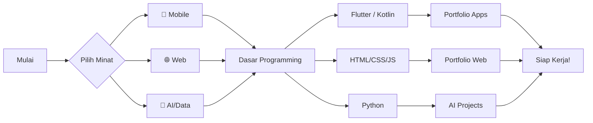

# Roadmap Developer

Jalan jadi developer itu gak harus linier. Tapi punya **peta** bakal bantu kamu tahu harus belajar apa selanjutnya.

## Tahapan Umum

### 🟢 Level 1: Fundamental (3-6 bulan)
- Logika pemrograman (if/else, loop, function)
- Satu bahasa pemrograman dasar
- Bikin project sederhana

### 🟡 Level 2: Intermediate (6-12 bulan)
- Framework (Flutter, React, Django)
- Version control (Git/GitHub)
- API & database
- Bikin project kompleks

### 🔴 Level 3: Advanced (12+ bulan)
- System design & architecture
- Testing & CI/CD
- Deployment & monitoring
- Bikin project production-ready

## Tips

1. **Fokus satu jalur dulu** — jangan overload
2. **Bikin project nyata** — belajar dengan bikin, bukan cuma baca
3. **Bergabung komunitas** — diskusi, tanya, berbagi
4. **Gagal itu wajar** — setiap error adalah pelajaran
5. **Bangun portfolio** — tunjukkin hasil karyamu!
