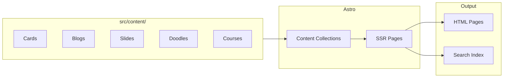
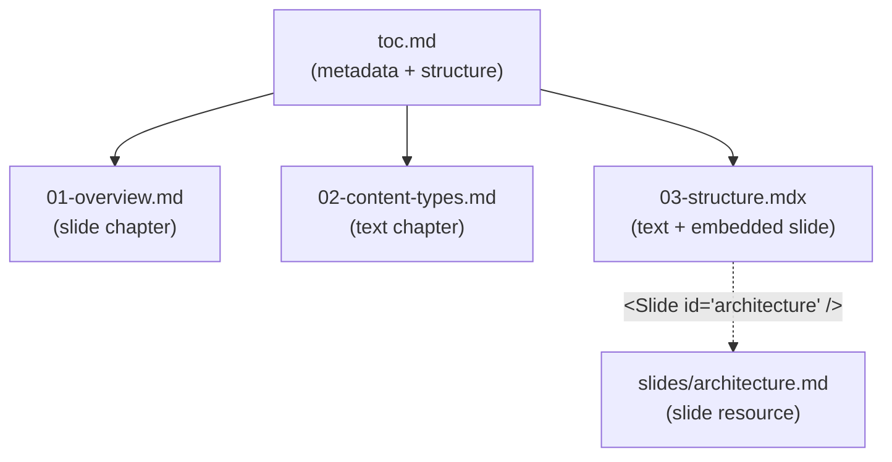

## Content Pipeline



---

## Key Directories

```text
src/
├── content/        # All content (Markdown)
├── components/     # Astro + React components
├── pages/          # File-based routing
├── schemas/        # Zod schemas per content type
├── lib/            # Shared utilities
└── styles/         # Global CSS
```

---

## Courses Are Composed


