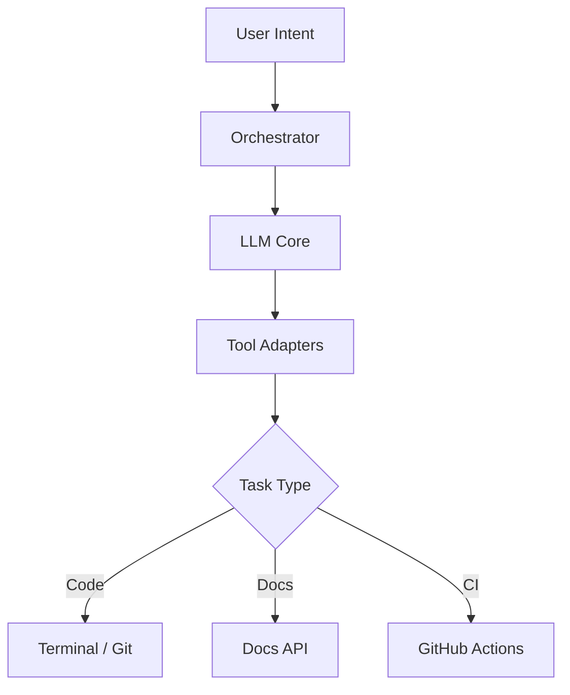

# AI Agent Engineer

> **Kamu pernah ingin punya asisten coding yang bisa otomatis bikin PR, review kode, dan deploy?** AI Agent Engineer hadir sebagai solusinya.

---

## Masalahnya

Tanpa AI Agent, workflow manual terlalu sering:

```bash
# Manual setup project baru
git checkout -b feature/new-feature
# Buka editor, tulis kode
# Jalankan test
# Buat PR via browser
# Review manual...
```

| Masalah | Dampak |
|---|---|
| Workflow manual berulang | Waktu terbuang |
| Review kode konsisten | Lupa cek beberapa aspek |
| Deploy manual rawan error | Bisa salah rollback |

**AI Agent Engineer** otomatisasi seluruh siklus ini secara aman.

---

## Kenapa Ini Penting?

| Skill | Manfaat |
|---|---|
| AI-assisted coding | Produktivitas naik 2-3x |
| Automated review | Konsistensi standar kode |
| CI/CD otomatis | Deploy lebih cepat & aman |

---

## Konsep Inti

### 1. Arsitektur AI Agent



### 2. Komponen Utama

| Komponen | Fungsi |
|---|---|
| LLM (OpenCode/Claude) | Otak berpikir |
| Tool Layer | Terminal, git, CI |
| Workflow Engine | Orkestrasi tugas |

### 3. Use-Case

- Otomatisasi pull-request
- Penulisan dokumentasi
- Pengujian otomatis
- Deployment CI/CD

---

## Contoh Lengkap

```python
# ai_agent.py - AI Agent sederhana untuk bikin modul logging

import subprocess

class AIAgent:
    def __init__(self, llm_client):
        self.llm = llm_client
    
    def create_branch(self, name: str) -> None:
        subprocess.run(["git", "checkout", "-b", f"feature/{name}"])
    
    def generate_code(self, goal: str) -> str:
        response = self.llm.chat.completions.create(
            model="gpt-4",
            messages=[{"role": "user", "content": goal}]
        )
        return response.choices[0].message.content
    
    def write_file(self, path: str, content: str) -> None:
        with open(path, "w") as f:
            f.write(content)
    
    def run_tests(self) -> bool:
        result = subprocess.run(["pytest", "-q"], capture_output=True)
        return result.returncode == 0

# Usage
agent = AIAgent(llm_client)
agent.create_branch("logging")
code = agent.generate_code("Write Python logging module with JSON output")
agent.write_file("src/logging.py", code)
if agent.run_tests():
    print("Ready for PR!")
```

---

## Common Mistakes

### ❌ Salah: Jalankan AI tanpa review

```python
agent.generate_code("").write_file("main.py")  # Gak aman!
```

**✅ Bener:** Gunakan safety wrapper

```python
code = agent.generate_code(goal)
validated = validate_code(code)  # Review dulu!
agent.write_file("main.py", validated)
```

### ❌ Salah: Prompt tidak jelas

```
"buat kode"
```

**✅ Bener:** Gunakan format Problem → Goal → Constraints

```
Problem: User perlu login
Goal: Buat auth module
Constraints: JWT, expired 1h, role-based
```

### ❌ Salah: Gak ada error handling

```python
agent.run_tests()  # Bisa crash!
```

**✅ Bener:** Handle semua exception

```python
try:
    if agent.run_tests():
        agent.create_pr()
except Exception as e:
    agent.notify(f"Failed: {e}")
```

---

## 🧪 Main Langsung

Coba AI Agent di playground: [OpenCode Playground](/articles/ai/ai-agent/playground)

---

## Lanjutan

| Format | Link |
|---|---|
| 🎞 **Slide Presentasi** | [AI Agent Slides](https://roiskhoiron.github.io/slides/ai-agent-engineer) |
| 🎓 **Tutorial Lengkap** | [Mulai Tutorial →](/articles/ai/ai-agent/tutorial) |
| ❓ **Quiz** | [Uji Pemahaman →](/articles/ai/ai-agent/quiz) |