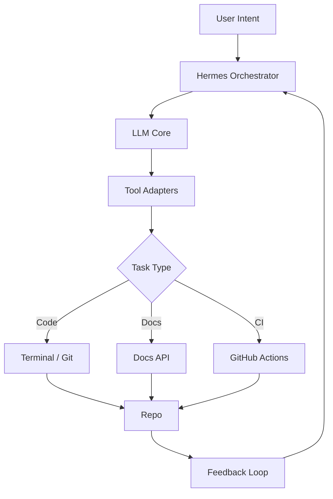

# Slide 1: Judul
## AI Agent Engineer
### Konsep, Arsitektur, dan Implementasi Praktis
**Presenter:** Khoiron Rois  
**Event:** CodingSkuy Learning Series

---

# Slide 2: Agenda
1. Apa itu AI Agent Engineer?
2. Arsitektur Referensi
3. Workflow Fire (SpecsMD)
4. Contoh Implementasi
5. Best Practices
6. Roadmap Pembelajaran

---

# Slide 3: Definisi AI Agent Engineer
- **Agen AI** yang dilengkapi kemampuan:
  - Pemroманان & debugging
  - Interaksi dengan git, CI/CD
  - Manajemen proyek & dokumentasi
- Beroperasi **otonom** atau **semi‑otonom**
- Fokus: otomatisasi tugas *software engineering*

---

# Slide 4: Komponen Utama
- **LLM Core** (OpenCode, Claude, Gemini)
- **Orkestrasi** (Hermes, SpecsMD Fire)
- **Tooling Layer** (terminal, git, issue tracker, dokumen)
- **Feedback Loop** (review, testing, monitoring)

---

# Slide 5: Arsitektur Referensi (Mermaid)


---

# Slide 6: Workflow Fire (SpecsMD)
1. **Capture Intent** – input pengguna
2. **Decompose** – pecah menjadi subtugas
3. **Delegate** – `delegate_task` ke sub‑agent
4. **Execute** – terminal, kode, PR
5. **Review** – LLM review & komentar
6. **Merge & Deploy** – CI/CD otomatis

---

# Slide 7: Contoh Implementasi – Bot Logging
```bash
# Buat branch
hermes exec "git checkout -b feature/logging"
# Delegasi kode
hermes delegate_task --goal "Buat modul logging JSON" --toolsets terminal,code
# Tambahkan test
hermes exec "pytest -q"
# Buat PR
hermes exec "gh pr create -t 'Add logging module'"
```

---

# Slide 8: Monitoring CI Failures
- Sub‑agent memantau workflow via `process(action='poll')`
- Jika gagal → buat otomatis issue dengan label `ci-failure`

---

# Slide 9: Best Practices (Tabel)
| Area | Rekomendasi |
|------|-------------|
| Prompting | Problem → Goal → Constraints + contoh |
| Safety | `background` + `notify_on_complete=true` |
| Versioning | branch `ai-agent-vX`, tag |
| Dokumentasi | auto‑generate README dari template |
| Publikasi | GitHub Discussions → Issues, label `documentation` |

---

# Slide 10: Roadmap Pembelajaran
1. **Fundamentals** – prompt engineering, tool integration
2. **Hands‑On** – proyek mini: *AI Code Reviewer*
3. **Scale** – integrasi MCP, gunakan `ctx_*` untuk efisiensi
4. **Publish** – artikel Medium, slide deck, contoh repo

---

# Slide 11: Kesimpulan
- AI Agent Engineer menggabungkan LLM dengan tooling pengembangan
- Workflow Fire memberikan struktur yang jelas
- Implementasi nyata bisa dilakukan hari ini dengan Hermes + OpenCode/Claude
- Kontribusi terbuka (open‑source) meningkatkan credibilitas teknis

---

# Slide 12: Q&A
## Pertanyaan?
**Terima Kasih!**  
Khoiron Rois – Founder CodingSkuy  
[GitHub](https://github.com/roiskhoiron) | [Medium](https://medium.com/@roiskhoiron)
