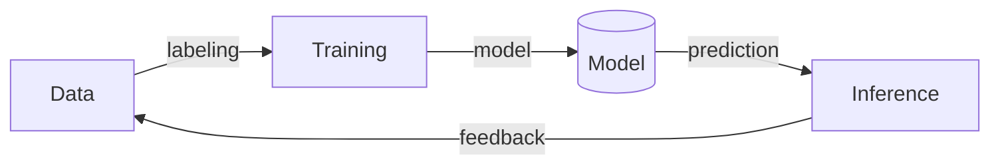

# Belajar Programming di Era AI

## Untuk Anak SD & SMP

**CodingSkuy** — Platform Belajar Coding untuk Anak Indonesia

---
layout: section
---

# Kenapa Programming di Era AI?

---
layout: fact
---

# AI mengubah alat, bukan cara berpikir.

**Compiler → Copilot**  
**Stack Overflow → ChatGPT**  

Fundasi logical thinking tetap sama.

---
layout: default
---

# 5 Kompetensi Utama

| | Skill | Dampak untuk Anak |
|---|---|---|
| 🧠 | **Logical Thinking** | Memecah masalah → langkah kecil |
| 🔍 | **Problem Solving** | Debug → Learn → Improve |
| 🎨 | **Creativity** | Kode sebagai media ekspresi |
| 💪 | **Resilience** | Bangkit dari error |
| 🤖 | **AI Literacy** | Paham data, model, inference |

**Fakta Penting**: Anak yang bisa coding di era AI **bukan digantikan** — mereka justru yang paling cerdas memanfaatkan AI sebagai teman belajar! 🤖✨

---
layout: section
---

# Pendekatan Berdasarkan Usia

---
layout: default
---

## 🧒 SD Kelas 1‑3 (6‑8 Tahun)

**Fokus: Logika tanpa layar + eksplorasi visual**

| Aktivitas | Tools | Konsep |
|---|---|---|
| Algoritma "Membuat Sandwich" | Kartu bergambar | Sequencing |
| Animasi robot | ScratchJr | Loop, event |
| Robot gerak | Botley / Code‑a‑Pillar | Instruksi berurutan |

```text
🚶 → 🔄 → 🧱 → ✅  
  (start) (repeat 4) (move 10) (done)
```

> 🎯 **Target**: Cerita interaktif dalam ≤15 blok

---
layout: default
---

## 🧒 SD Kelas 4‑6 (9‑12 Tahun)

**Fokus: Proyek kreatif + integrasi AI**

- **Scratch** — Game "Catch the Star" (variabel + broadcast)
- **Micro:bit** — Sensor cahaya + LED
- **Roblox Studio / Minecraft Education** — Lingkungan familiar
- **Teachable Machine** — Latih model AI dengan gambar/suara

**Konsep yang dipelajari**:  
`variable` → `loop` → `condition` → `event` → `AI inference`

> 🎯 **Target**: Game sederhana + chatbot AI mini

---
layout: default
---

## 🧑 SMP (13‑15 Tahun)

**Fokus: Bahasa teks + AI‑assisted coding**

| Aktivitas | Tools |
|---|---|
| Python dasar (functions, modules) | Replit, Google Colab |
| Quiz Bot dengan OpenAI | Python + OpenAI API |
| AI‑assisted coding | Cursor / GitHub Copilot |
| Unit Testing | pytest |
| Version Control | Git + GitHub |

```text
┌─ Input ──────┐     ┌─ AI ──────────┐     ┌─ Output ─────┐
│ "Buat soal    │────>│ GPT-3.5 turbo  │────>│ Pilihan ganda │
│  tentang loop"│     │ (via Copilot)  │     │ coding SMP    │
└───────────────┘     └───────────────┘     └──────────────┘
```

> 🎯 **Target**: Program Python fungsional + kolaborasi dengan AI

---
layout: section
---

# Studi Kasus Langsung

---
layout: default
---

## Studi Kasus: *Chatbot "Teman Belajar"*

**Target**: SD Kelas 4‑6 | **Tools**: Teachable Machine + Python

### Langkah 1 — Kumpulkan Data
```text
["Halo", "Hai", "Apa kabar"]  → intent: sapaan
["Bye", "Dah", "Sampai nanti"] → intent: perpisahan
```

### Langkah 2 — Latih Model
Upload ke teachablemachine.withgoogle.com  
→ Export `model.json`

### Langkah 3 — Python
```python
model = tf.keras.models.load_model('model.json')
text = recognizer(audio)  # speech → text
pred = model.predict(vectorizer([text]))
print("🤖 Hai!" if np.argmax(pred)==0 else "🤖 Dah!")
```

---

<v-click>

### 📌 Poin Belajar:
- **Data** → **Model** → **Inference** cycle
- AI tidak sempurna ➜ *cek akurasi*
- Bisa ditambah intent baru

</v-click>

---
layout: default
---

## Studi Kasus: *Quiz Bot* (SMP)

**Target**: SMP Kelas 7‑9 | **Tools**: Python + OpenAI API

```python {all|2|4-8|10-14}
import os, openai
openai.api_key = os.getenv('OPENAI_API_KEY')

def ask_question(topic):
    resp = openai.ChatCompletion.create(
        model='gpt-3.5-turbo',
        messages=[{'role':'system',
          'content':'Buat soal pilihan ganda coding.'},
          {'role':'user','content':topic}])
    return resp['choices'][0]['message']['content']

while True:
    q = input('Topik: ')
    if q == 'exit': break
    print(ask_question(q))
```

<v-click>

### 🎯 Latihan Tambahan:
- Tambahkan **pytest** untuk validasi output
- Simpan history ke file JSON
- Gunakan **streaming** output

</v-click>

---
layout: default
---

# 🎮 Cek Pemahaman — Siklus AI

Klik jawaban yang benar!

<QuizCoding
  :soal="{
    pertanyaan: 'Apa urutan yang benar dalam siklus AI?',
    pilihan: [
      'Training → Data → Inference',
      'Data → Training → Inference',
      'Inference → Data → Training',
      'Model → Data → Training'
    ],
    jawabanBenar: 1,
    feedbackBenar: 'Urutan Data → Training → Inference adalah fondasi AI! 🎯',
    feedbackSalah: 'Ingat: AI belajar dari Data, lalu Training, lalu Inference.'
  }"
  @next=""
/>

---
layout: default
---

# 🎮 Cek Pemahaman — Bias AI

<QuizCoding
  :soal="{
    pertanyaan: 'Apa yang terjadi jika AI hanya dilatih dengan foto kucing anggora?',
    pilihan: [
      'AI akan mengenali semua kucing dengan sempurna',
      'AI akan gagal mengenali kucing kampung',
      'AI tidak akan bisa membedakan kucing dan anjing',
      'Tidak ada dampak apapun'
    ],
    jawabanBenar: 1,
    feedbackBenar: 'Tepat! AI akan bias karena datanya tidak beragam. 🐈',
    feedbackSalah: 'Data yang tidak beragam menyebabkan AI bias — coba tebak lagi!'
  }"
  @next=""
/>

---
layout: default
---

# 🎮 Cek Pemahaman — Programming

<QuizCoding
  :soal="{
    pertanyaan: 'Apa fungsi utama dari variabel dalam coding?',
    pilihan: [
      'Menyimpan data seperti angka atau teks',
      'Mengulang perintah terus menerus',
      'Menggambar lingkaran di layar',
      'Menyalakan lampu LED'
    ],
    jawabanBenar: 0,
    feedbackBenar: 'Betul! Variabel menyimpan data yang bisa dipakai ulang. 🗂️',
    feedbackSalah: 'Hampir! Variabel digunakan untuk menyimpan data.'
  }"
  @next=""
/>

---
layout: section
transition: slide-up
---

# Deep‑Dive AI Literacy

---
layout: default
---

# Siklus AI: Data → Training → Inference



<v-clicks>

- **Data** → Kumpulan contoh (gambar/suara/teks)
- **Training** → Model mencari pola dari data
- **Inference** → Model memprediksi data baru
- **Feedback** → Data baru memperbaiki model

</v-clicks>

---
layout: default
transition: fade
---

# Memahami Bias pada AI

**Kasus**: Model hanya dilatih foto kucing anggora  
→ Gagal mengenali kucing kampung 🐈

| Dampak | Solusi |
|---|---|
| Model tidak adil | Data beragam |
| Akurasi rendah | Data augmentation |
| Overfitting | Validation set |

**Aktivitas**: Coba deteksi bias di Teachable Machine sendiri!

> 🔑 **Pelajaran**: AI secerdas data yang kita berikan.

---
layout: section
---

# FAQ & Tips

---
layout: default
---

## FAQ Cepat

| Pertanyaan | Jawaban |
|---|---|
| Copilot gratis? | ✅ Free tier 60 menit/bulan |
| Python untuk anak 10 tahun? | ✅ Replit + guided exercises |
| Token API aman? | ✅ `.env` + gitignore |
| Model tidak akurat? | Cek data & label konsisten |
| Anak malas debugging? | Jadikan *game* — tebak errornya! |

---
layout: default
---

# Tips untuk Orang Tua

| ✅ Lakukan | ❌ Hindari |
|---|---|
| Biarkan eksplorasi | Target terlalu tinggi |
| Rayakan progress kecil | Bandingkan dengan anak lain |
| Coding bersama = bonding | Biarkan sendiri terus |
| Tanya "Apa yang kamu buat?" | Hanya tanya "Sudah sampai mana?" |
| AI sebagai alat bantu | AI kerjakan semuanya |

---
layout: quote
transition: fade
---

# "The role of the computer is not to replace the teacher, but to provide a new kind of environment for learning."

— **Seymour Papert**

---
layout: default
---

# Roadmap 3 Bulan

| Bulan | Fokus | Tools | Artefak |
|---|---|---|---|
| **1** | Logika + Visual | ScratchJr, Botley | Storyboard |
| **2** | AI + Proyek | Scratch, Teachable Machine | Game + Chatbot Mini |
| **3** | Python + AI‑Assisted | Replit, Copilot, OpenAI | Quiz Bot + Tests |

**Checkpoint tiap minggu**: Presentasi 3 menit dari slide ini.

---
layout: cover
---

# Mulai Sekarang!

[roiskhoiron.github.io/articles](https://roiskhoiron.github.io/articles)

---

**CodingSkuy** — Belajar Coding untuk Anak Indonesia 🇮🇩
